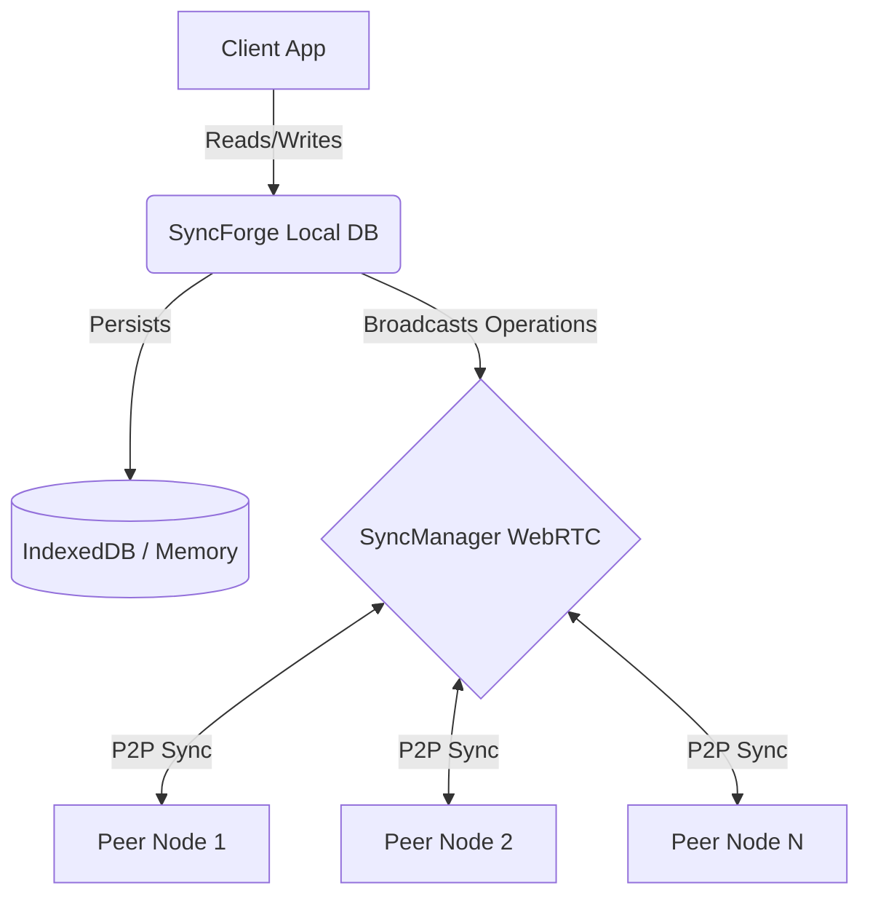

<!--
// Copyright (c) 2024-2026 Soumya Debnath. All Rights Reserved.
// Dual-licensed: AGPL-3.0-or-later (free, see LICENSE) OR a commercial licence
// (see COMMERCIAL_LICENSE.md) if you cannot meet the AGPL's source-disclosure terms.
// Contact: soumyadebnath1661@gmail.com
-->

# SyncForge

**SyncForge keeps application state consistent across devices and collaborators using CRDTs, so edits merge deterministically without a central database and keep working offline.**

[](https://www.gnu.org/licenses/agpl-3.0)
[]()
[]()

---

> **WARNING — npm name collision.** The package name `syncforge` on the npm registry is owned by an unrelated author (`codewithcobby`). Running `npm install syncforge` installs their package, not this one. This is a silent failure — your project will compile against the wrong library. A rename of this project is pending the author's decision. **Do not use `npm install syncforge`.**

---

SyncForge is a CRDT-powered, local-first database library for real-time peer-to-peer synchronisation. It writes to local storage instantly and propagates changes to connected peers over WebRTC DataChannels in the background.

## Table of Contents
1. [Installation](#installation)
2. [Quick Start](#quick-start)
3. [Architecture](#architecture)
4. [API Reference](#api-reference)
5. [CRDT Types](#crdt-types-explained)
6. [Storage Adapters](#storage-adapters)
7. [Performance Benchmarks](#performance-benchmarks)
8. [Comparison Table](#comparison-table)
9. [Security Model](#security-model)
10. [Known Limitations](#known-limitations)
11. [FAQ](#faq)
12. [Author & License](#author--license)

---

## Installation

This library is **not published to npm**. Use one of these two paths:

### Option A — jsDelivr CDN (browser, no build step)

```html
<script type="module">
  import { SyncForge } from 'https://cdn.jsdelivr.net/gh/itsoumya-d/syncforge@main/dist/index.mjs';
</script>
```

### Option B — Clone and build

```bash
git clone https://github.com/itsoumya-d/syncforge.git
cd syncforge
npm install
npm run build
# dist/ is now available locally
```

---

## Quick Start

```typescript
import { SyncForge } from 'https://cdn.jsdelivr.net/gh/itsoumya-d/syncforge@main/dist/index.mjs';

// Initialize
const db = new SyncForge({ dbName: 'my-app-db' });

// Get a collection
const users = db.collection('users');

// Listen for connection events
db.on('online', () => console.log('Connected to peers'));

// Connect to P2P signaling server
db.connectPeer('wss://signaling.example.com');
```

---

## Architecture

SyncForge employs a local-first architecture. It writes to local storage first, then emits vector-clocked operations to connected peers.



- **Local-First:** All CRUD operations hit the local storage adapter instantly.
- **SyncManager:** Listens for local changes and queues them for broadcast.
- **CRDT Resolution:** When a remote operation arrives, CRDT properties guarantee all peers converge on the same state regardless of delivery order.

---

## Usage Examples

### 1. Create DB & Add Documents
```typescript
const db = new SyncForge({ dbName: 'todo-db' });
const todos = db.collection('todos');

await todos.set('todo-1', { title: 'Buy milk', completed: false });
await todos.set('todo-2', { title: 'Read book', completed: true });
```

### 2. Querying Documents
```typescript
const pendingTodos = await todos
  .where('completed', '==', false)
  .orderBy('title', 'asc')
  .limit(10)
  .get();
```

### 3. Real-Time Subscriptions
```typescript
const unsubscribe = todos.subscribe((data) => {
  console.log('Collection updated:', data);
});

const unsubDoc = todos.subscribeDoc('todo-1', (doc) => {
  console.log('Todo 1 changed:', doc);
});
```

### 4. Offline Writes & P2P
```typescript
// Writes are stored in IndexedDB while offline.
await todos.set('todo-3', { title: 'Write code' });

// Connect to a peer network. You must run the signaling server yourself.
db.connectPeer('wss://signaling.yourserver.com');
```

> **Offline writes are NOT replayed automatically.** There is no outbox. Operations
> made while no peer data channel is open are persisted locally but are never
> re-sent, and reconnecting peers do not reconcile vector clocks to find out what
> they missed. To backfill, exchange snapshots explicitly:
>
> ```typescript
> const snapshot = await db.exportData();   // JSON array of operations
> await peerDb.importData(snapshot);        // idempotent — safe to replay
> ```

---

## API Reference

### `SyncForge`

- `constructor(options: { dbName: string; peerId?: string })` — initialises the database. If `peerId` is omitted, one is randomly generated.
- `collection(name: string): Collection` — returns a Collection instance.
- `connectPeer(signalingUrl: string): void` — *starts* connecting to a signaling server. It is synchronous and returns nothing; connection success is reported via events, not by this call.
- `isOnline(): boolean` — `true` only while at least one peer data channel is open.
- `disconnect(): void` — disconnects from all peers.

#### Connection events

| Event | Meaning |
|---|---|
| `connecting` | `connectPeer()` was called |
| `online` | the first peer data channel opened |
| `offline` | the last peer data channel closed, or signaling failed permanently |
| `peer-connected` / `peer-disconnected` | a specific peer's channel opened / closed |
| `peer-unreachable` | ICE reached `failed` or `disconnected` for a peer — this is the symmetric/CGNAT case |
| `ice-state` | every ICE connection-state transition, with the peer id |
| `ice-candidate-error` | a STUN/TURN candidate could not be gathered |
| `signaling-failed` | the signaling socket did not come up after 5 attempts (~31 s of backoff) |
| `error` | signaling socket error, or any of the above surfaced as an `Error` |

`peer-unreachable` is what distinguishes "network failure" from "peer left voluntarily"; `peer-disconnected` alone does not.
- `exportData(): Promise<string>` — exports all stored operations as a JSON string.
- `importData(json: string): Promise<void>` — imports data and applies it locally.

### `Collection`

- `set(id: string, data: object): Promise<void>`
- `get(id: string): Promise<Document | null>`
- `delete(id: string): Promise<void>`
- `getAll(): Promise<Document[]>`
- `where(field: string, op: Operator, value: any): Query`
- `orderBy(field: string, direction: 'asc'|'desc'): Query`
- `limit(n: number): Query`
- `increment(id: string, field: string, amount?: number): Promise<void>`
- `decrement(id: string, field: string, amount?: number): Promise<void>`
- `subscribe(callback: (docs: Document[]) => void): () => void`
- `subscribeDoc(id: string, callback: (doc: Document|null) => void): () => void`

### `Query`

- `where(field, op, value): Query`
- `orderBy(field, direction): Query`
- `limit(n): Query`
- `get(): Promise<Document[]>`
- `subscribe(callback): () => void`

---

## CRDT Types Explained

All CRDT types are exported and usable directly:

### `LWWRegister` (Last-Writer-Wins Register)
Stores a single value. Accesses the value via `.value` (property). Resolves conflicts by timestamp, then by peer ID.
```typescript
import { LWWRegister } from '...'; // from dist/index.mjs
const reg = new LWWRegister('initial', 1, 'peerA');
reg.set('updated', 2, 'peerB');
console.log(reg.value); // 'updated'
```

### `GCounter` (Grow-Only Counter)
Value accessed via `.value` getter (not `.value()`). Throws on negative increment.
```typescript
import { GCounter } from '...';
const counter = new GCounter();
counter.increment('peerA', 5);
console.log(counter.value); // 5
```

### `PNCounter` (Positive-Negative Counter)
Value accessed via `.value` getter.
```typescript
import { PNCounter } from '...';
const pn = new PNCounter();
pn.increment('peerA', 10);
pn.decrement('peerA', 3);
console.log(pn.value); // 7
```

### `ORSet` (Observed-Remove Set)
Elements accessed via `.values` getter (not `.values()`).
```typescript
import { ORSet } from '...';
const set = new ORSet();
set.add('id1', 'apple');
console.log(set.values); // ['apple']
set.remove('id1');
```

### `VectorClock`
Requires a `peerId` argument in the constructor. Uses `.increment()`, `.getClock()`, `.getTimestamp()`, `.update(remoteClock)`.
```typescript
import { VectorClock } from '...';
const vc = new VectorClock('peerA');
vc.increment();
console.log(vc.getTimestamp()); // 1
```

### `LWWMap` (Last-Writer-Wins Map)
A key-value map where each value is an `LWWRegister`.
```typescript
import { LWWMap } from '...';
const map = new LWWMap();
map.set('title', 'Hello', Date.now(), 'peerA');
console.log(map.get('title')); // 'Hello'
```

---

## Storage Adapters

1. **`IndexedDBAdapter`** — browser default. Data persists across page reloads.
2. **`MemoryAdapter`** — Node.js and testing. Ephemeral; data is lost on process exit. API: `get(collection, id)`, `set(collection, id, data)`, `delete(collection, id)`, `getAll(collection)`.

Both implement a common `StorageAdapter` interface.

---

## Performance Benchmarks

Measured on Node 24, Intel Xeon 2.90 GHz (2 cores), using `MemoryAdapter`:

| Operation | 1000 iterations | Per-op average |
|---|---|---|
| `col.set()` | 22 ms | 0.022 ms |
| `col.get()` | 2 ms | 0.002 ms |

These numbers are memory-only; IndexedDB writes in the browser will be slower. P2P sync latency is network-dependent and not measured here.

**Read this caveat before trusting the table.** It measures 1000 writes across 1000 *distinct* documents, which is the fast path. Writes to a **single** document are O(n²), because each operation rebuilds that document's entire LWW map from stored metadata. Measured on the same machine:

| Writes to one document | total | per op |
|---|---|---|
| 250 | 35 ms | 0.14 ms |
| 1 000 | 370 ms | 0.37 ms |
| 4 000 | 6 540 ms | 1.64 ms |

Doubling the number of writes roughly quadruples the time. Collaborative editing of one shared document — the use case this library is for — is the slow path, not the fast one.

---

## Comparison Table

| Feature | SyncForge | Firebase | Supabase | MongoDB | RxDB |
|---|---|---|---|---|---|
| **Architecture** | P2P Local-First | Cloud-First | Cloud-First | Cloud-First | Local-First |
| **Cost** | signaling + TURN only (no DB) | High (Usage) | Medium | High | Free (Premium plugins) |
| **Offline Support** | Full | Partial | Partial | None | Full |
| **Sync Mechanism** | WebRTC CRDTs | Centralized | Centralized | Centralized | CouchDB / GraphQL |
| **Conflict Res** | Auto (CRDT) | Last-Write | Last-Write | Last-Write | Custom |

---

## Security Model

- **E2E Encryption:** SyncForge does not encrypt data at rest or in transit. For sensitive data, encrypt payloads before calling `.set()`.
- **Signaling Server:** The WebRTC signaling server only brokers connections; it does not see database contents.
- **Validation:** Peers should validate incoming operations to prevent injection of unauthorised timestamps. Inbound frames are length-checked and malformed frames are dropped with a warning, but operation *contents* are trusted.
- **License key check:** `LicenseValidator` only emits a `console.warn`; its result is not enforced anywhere and any key beginning with `BSL11-` satisfies it. Treat it as a notice, not a control.

---

## Known Limitations

- **Pre-release status.** Not on npm. No production adopters. API may change.
- **No npm publication.** Running `npm install syncforge` installs an unrelated library. See Installation above.
- **No TURN relay — connections fail behind symmetric or carrier-grade NAT.** The ICE configuration uses a single public STUN server (`stun:stun.l.google.com:19302`), and there is no `iceTransportPolicy` or `iceCandidatePoolSize` setting. STUN cannot traverse symmetric NAT (common on corporate networks) or many mobile carrier-grade NAT deployments. ICE failure is reported as `peer-unreachable` (with `reason: 'ice-failed'`) and as `ice-state`, so it *can* be told apart from a voluntary `peer-disconnected`. If you need reliable connectivity across arbitrary networks, configure your own TURN server. There is no connection timeout: nothing gives up on a peer whose ICE never completes, so apply your own deadline.
- **A signaling server is required and is not provided.** `connectPeer()` needs a WebSocket endpoint speaking `join` / `peer-joined` / `offer` / `answer` / `ice-candidate` / `peer-left`, each carrying `peerId` and (for the routed types) `target`. No reference implementation ships with this repository.
- **No dropped-operation recovery.** Delivery is whatever the data channel gives you. There is no anti-entropy protocol: if an operation is lost, replicas stay divergent until you resynchronise them yourself with `exportData()` / `importData()`. Duplicate delivery *is* safe — operations are deduplicated by id.
- **`LWWMap` caps documents at 10 000 keys** as a state-bomb mitigation. Writes past the cap are dropped with a `console.warn`, and two replicas that reach the cap having learned different keys will not converge.
- **Browser-only IndexedDB.** Node.js uses `MemoryAdapter` which is ephemeral.
- **No authentication.** Any peer knowing your signaling room ID can join.
- **Large binary files.** SyncForge is optimised for JSON documents. Store large blobs elsewhere and sync their URLs.

---

## FAQ

**Q: Do I need a backend?**
A: You need a WebRTC signaling server to broker initial peer connections. No database backend is required.

**Q: What happens if all peers go offline?**
A: Data stays safely in the browser's IndexedDB. When a peer reconnects, it exchanges operations and converges.

**Q: Does it support large binary files?**
A: Not directly. Store them in IPFS or S3 and sync the URL via SyncForge.

---

## 📄 License

**Dual-licensed — choose either:**

1. **[AGPL-3.0-or-later](LICENSE)** — free for any purpose, including commercial and production
   use. No payment, no permission, no key required. The obligation it carries: if you modify this
   software and let users interact with it over a network, you must offer those users your modified
   source under the same licence.

2. **[Commercial licence](COMMERCIAL_LICENSE.md)** — for organisations that cannot or prefer not to
   meet the AGPL's source-disclosure obligation. This buys an exception, not access.

Contributions are accepted under AGPL-3.0-or-later.

## ⚖️ Commercial licence (optional)

> **This software is free under [AGPL-3.0-or-later](LICENSE) — including for commercial and
> production use.** The prices below buy one specific thing: an exception to the AGPL's requirement
> that you publish your modifications if you run a modified version as a network service.

| Tier | Price | For |
|:-----|:------|:----|
| **Indie** | $399/year | Solo developer, <$100K revenue |
| **Startup** | $2,999/year | Up to 10-25 devs, <$5M revenue |
| **Enterprise** | $14,999/year | Unlimited seats, unlimited revenue |
| **OEM / White-Label** | $29,999/year | Embed in your product |
| **Full IP Buyout** | $1,500,000 | Complete ownership transfer |

**Free under AGPL-3.0-or-later:** any use, including production and commercial, provided you meet the AGPL's terms.

[soumyadebnath1661@gmail.com](mailto:soumyadebnath1661@gmail.com) · [github.com/itsoumya-d](https://github.com/itsoumya-d)

© 2024-2026 Soumya Debnath. All Rights Reserved.
