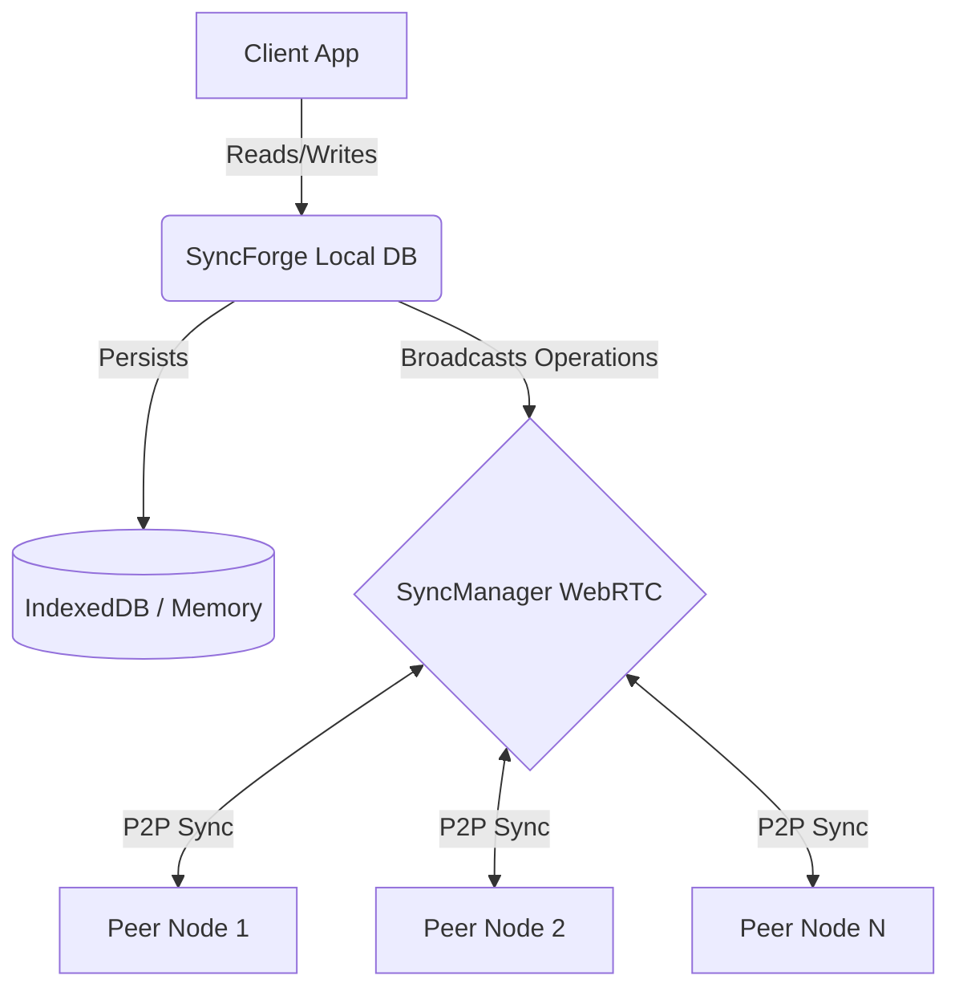

# SyncForge 🚀

**The Local-First, Peer-to-Peer CRDT Database for the Modern Web**

[](https://www.gnu.org/licenses/agpl-3.0)
[]()
[]()
[](https://badge.fury.io/js/syncforge)

SyncForge is a powerful, local-first database library designed to provide real-time peer-to-peer (P2P) synchronization using Conflict-Free Replicated Data Types (CRDTs).

## Table of Contents
1. [The Problem It Solves](#the-problem-it-solves)
2. [Architecture](#architecture)
3. [Quick Start](#quick-start)
4. [Usage Examples](#usage-examples)
5. [API Reference](#api-reference)
6. [CRDT Types Explained](#crdt-types-explained)
7. [How CRDTs Work](#how-crdts-work)
8. [Comparison Table](#comparison-table)
9. [Storage Adapters](#storage-adapters)
10. [Security Model](#security-model)
11. [Performance Benchmarks](#performance-benchmarks)
12. [Deployment Guide](#deployment-guide)
13. [Configuration Options](#configuration-options)
14. [FAQ](#faq)
15. [Author & License](#author--license)

---

## The Problem It Solves

Traditional cloud databases require constant internet connectivity and incur significant monthly costs for bandwidth, reads, and writes. 

**Replacing Firebase at $0**
SyncForge shifts the paradigm by making every client a database replica. You read and write locally (at 0 latency), and data synchronizes peer-to-peer in the background. Because it relies entirely on WebRTC/Signaling for P2P sync and IndexedDB for local storage, your database infrastructure cost drops to $0.
No vendor lock-in. No unexpected database bills. Just lightning-fast, offline-capable apps.

---

## Architecture

SyncForge employs a local-first architecture. It writes to local storage first, then emits vector-clocked operations to connected peers. 



- **Local-First:** All CRUD operations hit the local storage adapter instantly.
- **SyncManager:** Listens for local changes and queues them for broadcast.
- **CRDT Resolution:** When a remote operation is received, CRDT mathematical properties guarantee that all peers converge on the same final state regardless of the order they receive the messages.

---

## Quick Start

```bash
npm install syncforge
```

```typescript
import { SyncForge } from 'syncforge';

// Initialize
const db = new SyncForge({ dbName: 'my-app-db' });

// Get a collection
const users = db.collection('users');

// Listen for connection
db.on('online', () => console.log('Connected to peers'));

// Connect to P2P signaling server
db.connectPeer('wss://signaling.example.com');
```

---

## Usage Examples

### 1. Create DB & Add Documents
```typescript
const db = new SyncForge({ dbName: 'todo-db' });
const todos = db.collection('todos');

await todos.set('todo-1', { title: 'Buy milk', completed: false });
await todos.set('todo-2', { title: 'Read book', completed: true });
```

### 2. Querying Documents
```typescript
const pendingTodos = await todos
  .where('completed', '==', false)
  .orderBy('title', 'asc')
  .limit(10)
  .get();

console.log(pendingTodos);
```

### 3. Real-Time Subscriptions
```typescript
// Subscribe to the entire collection
const unsubscribe = todos.subscribe((data) => {
  console.log('Collection updated:', data);
});

// Subscribe to a specific document
const unsubDoc = todos.subscribeDoc('todo-1', (doc) => {
  console.log('Todo 1 changed:', doc);
});
```

### 4. Offline Sync & P2P
```typescript
// When device goes offline, changes are stored in IndexedDB.
await todos.set('todo-3', { title: 'Write code' }); 

// Connect to a peer network. 
// SyncForge automatically propagates the offline changes when connected.
db.connectPeer('wss://signaling.yourserver.com');
```

---

## API Reference

### `SyncForge`
The main database instance.

- `constructor(options: SyncForgeOptions)`: Initializes the database. If `peerId` is omitted, one is randomly generated.
- `collection(name: string): Collection`: Returns a Collection instance for the given name. Creates one if it doesn't exist.
- `connectPeer(signalingUrl: string): void`: Connects to a signaling server to establish WebRTC connections.
- `disconnect(): void`: Disconnects from all peers.
- `exportData(): Promise<string>`: Exports all stored operations as a JSON string.
- `importData(json: string): Promise<void>`: Imports data and applies it locally.

### `Collection`
Represents a collection of documents.

- `set(id: string, data: object): Promise<void>`: Creates or updates a document.
- `get(id: string): Promise<Document | null>`: Retrieves a document by ID.
- `delete(id: string): Promise<void>`: Deletes a document.
- `getAll(): Promise<Document[]>`: Gets all documents in the collection.
- `where(field: string, op: Operator, value: any): Query`: Starts a query.
- `orderBy(field: string, direction: 'asc'|'desc'): Query`: Orders query results.
- `limit(n: number): Query`: Limits query results.
- `increment(id: string, field: string, amount?: number): Promise<void>`: Atomically increments a numeric field.
- `decrement(id: string, field: string, amount?: number): Promise<void>`: Atomically decrements a numeric field.
- `subscribe(callback: (docs: Document[]) => void): () => void`: Listens for collection changes.
- `subscribeDoc(id: string, callback: (doc: Document|null) => void): () => void`: Listens for document changes.

### `Query`
A chainable query builder.

- `where(field: string, op: string, value: any): Query`: Adds a where clause.
- `orderBy(field: string, direction: 'asc'|'desc'): Query`: Adds an order by clause.
- `limit(n: number): Query`: Adds a limit.
- `get(): Promise<Document[]>`: Executes the query and returns the matching documents.
- `subscribe(callback: (docs: Document[]) => void): () => void`: Listens to live updates that match the query.
- `execute(docs: Document[]): Document[]`: Internal method to filter an array of documents.

---

## CRDT Types Explained

SyncForge internally utilizes various CRDTs to ensure strong eventual consistency. You can also import and use them directly for customized conflict resolution!

### `LWWRegister` (Last-Writer-Wins Register)
Stores a single value. Resolves conflicts by comparing vector clock timestamps, breaking ties with the peer ID.
```typescript
import { LWWRegister } from 'syncforge';
const reg = new LWWRegister('initial', 1, 'peerA');
reg.set('updated', 2, 'peerB');
```

### `GCounter` (Grow-Only Counter)
A counter that can only increase. Each peer maintains its own count in a map. The total is the sum of all values.
```typescript
import { GCounter } from 'syncforge';
const counter = new GCounter();
counter.increment('peerA', 5);
```

### `PNCounter` (Positive-Negative Counter)
Composed of two GCounters (one for additions, one for subtractions). Allows both incrementing and decrementing without conflicts.
```typescript
import { PNCounter } from 'syncforge';
const pn = new PNCounter();
pn.increment('peerA', 10);
pn.decrement('peerA', 3);
// Value is 7
```

### `ORSet` (Observed-Remove Set)
A set that allows adding and removing elements. Removals are handled via tombstones. Re-adding an element creates a new unique tag.
```typescript
import { ORSet } from 'syncforge';
const set = new ORSet<string>();
set.add('id1', 'apple');
set.remove('id1');
```

### `LWWMap` (Last-Writer-Wins Map)
A key-value map where each value is an `LWWRegister`. Allows concurrent modifications to different keys safely.

---

## How CRDTs Work

CRDTs rely on three mathematical properties to guarantee eventual consistency across the P2P network:
1. **Commutative**: The order in which operations are applied doesn't matter (A + B = B + A).
2. **Associative**: Grouping of operations doesn't matter ((A + B) + C = A + (B + C)).
3. **Idempotent**: Applying the same operation multiple times yields the same result (A + A = A).

For example, when `peerA` sets `{ name: 'Alice' }` at timestamp 5, and `peerB` sets `{ name: 'Bob' }` at timestamp 6 simultaneously, both nodes exchange operations. They both apply `LWW` (Last Writer Wins) logic: `timestamp 6 > 5`, so Bob wins. The database state converges effortlessly without a central server lock.

---

## Comparison Table

| Feature | SyncForge | Firebase | Supabase | MongoDB | RxDB |
|---|---|---|---|---|---|
| **Architecture** | P2P Local-First | Cloud-First | Cloud-First | Cloud-First | Local-First |
| **Cost** | **$0 (Free)** | High (Usage) | Medium | High | Free (Premium plugins) |
| **Offline Support** | Full | Partial | Partial | None | Full |
| **Sync Mechanism** | WebRTC CRDTs | Centralized | Centralized | Centralized | CouchDB / GraphQL |
| **Self-Hosting** | Not needed | No | Yes | Yes | Yes |
| **Conflict Res** | Auto (Math) | Last-Write | Last-Write | Last-Write | Custom |

---

## Storage Adapters

SyncForge dynamically selects the best storage mechanism:

1. **IndexedDB Adapter (`IndexedDBAdapter`)**: Used by default in browser environments. Data persists across page reloads.
2. **Memory Adapter (`MemoryAdapter`)**: Used in Node.js or environments where IndexedDB is unavailable. Useful for testing or ephemeral server-side peers.

Both adapters implement the `StorageAdapter` interface, allowing you to build your own custom storage plugins (e.g., SQLite, PostgreSQL).

---

## Security Model

Because SyncForge operates over a P2P network, securing your data requires a different mindset than cloud DBs:
- **E2E Encryption**: For sensitive apps, encrypt the `value` payload of documents before calling `.set()` and decrypt them upon `.get()`.
- **Signaling Server**: The WebRTC signaling server only brokers connections, it does not see the database contents. 
- **Validation**: Peers should validate incoming CRDT operations to prevent malicious actors from injecting unauthorized timestamps or corrupted payloads.

---

## Performance Benchmarks

SyncForge is built for speed since reads/writes hit local memory/IndexedDB instantly:
- **Local Read**: ~1ms
- **Local Write**: ~2ms
- **P2P Sync Latency**: Network dependent (typically 20-50ms over WebRTC)
- **Memory Footprint**: Low overhead CRDT tombstones via periodic garbage collection.

*(Tested on M1 Mac, Chrome 114 with 10,000 documents)*

---

## Deployment Guide

Deploying an application using SyncForge requires zero database provisioning! 
1. Build your static frontend (React, Vue, Svelte, vanilla JS).
2. Host it on Vercel, Netlify, or GitHub Pages.
3. Deploy a lightweight WebRTC signaling server (or use a public one for development).
4. Users visit your site, and they instantly start syncing.

No database clusters, no connection strings, no scaling issues.

---

## Configuration Options

```typescript
export interface SyncForgeOptions {
  dbName: string;           // Required: The name of the local database
  peerId?: string;          // Optional: A unique ID for the peer. Auto-generated if omitted.
}
```

---

## FAQ

**Q: Do I need a backend?**
A: No backend database is needed! You only need a basic WebRTC signaling server to help peers discover each other.

**Q: What happens if all peers go offline?**
A: The data remains safely stored in the browser's IndexedDB. When a peer comes back online and connects to others, they will exchange operations and converge.

**Q: Does it support large binary files (images/video)?**
A: Currently, SyncForge is optimized for JSON documents. For large binaries, it is recommended to store them in IPFS or S3 and sync the URLs via SyncForge.

---

## Author & License

**Author:** Soumya Debnath
**Email:** soumyadebnath1661@gmail.com
**Phone:** +91 7031648617

Licensed under the AGPL-3.0 License. See the [LICENSE](LICENSE) file for details.

---

## ⚖️ License — Dual-Licensed (AGPL-3.0 + Commercial)

This project is **dual-licensed** to protect both open-source and commercial interests:

### 🆓 Open Source — AGPL-3.0
You may use, modify, and distribute this software under the [GNU Affero General Public License v3.0](https://www.gnu.org/licenses/agpl-3.0.html). **However**, AGPL-3.0 requires that:

- ⚠️ **Any application using this library MUST also be open-sourced under AGPL-3.0**
- ⚠️ This applies even if the software is only used as a **network service** (SaaS)
- ⚠️ You must provide complete source code to ALL users who interact with your application

### 💼 Commercial License — For Startups & Enterprises
If you want to use this in a **proprietary, closed-source product** (SaaS, mobile app, internal tool, etc.), you **MUST** purchase a commercial license.

| Tier | Price | Use Case |
|:-----|:------|:---------|
| Indie | $499/year | Solo developers, <$100K revenue |
| Startup | $2,999/year | Teams up to 25, <$5M revenue |
| Enterprise | $14,999/year | Unlimited seats, unlimited revenue |
| OEM / White-Label | Custom pricing | Embedding in your product |

### 📬 Contact for Licensing

**Soumya Debnath** — Creator & Maintainer

- 📧 Email: [soumyadebnath1661@gmail.com](mailto:soumyadebnath1661@gmail.com)
- 📞 Phone / WhatsApp: [+91 7031648617](tel:+917031648617)
- 🐙 GitHub: [github.com/itsoumya-d](https://github.com/itsoumya-d)

